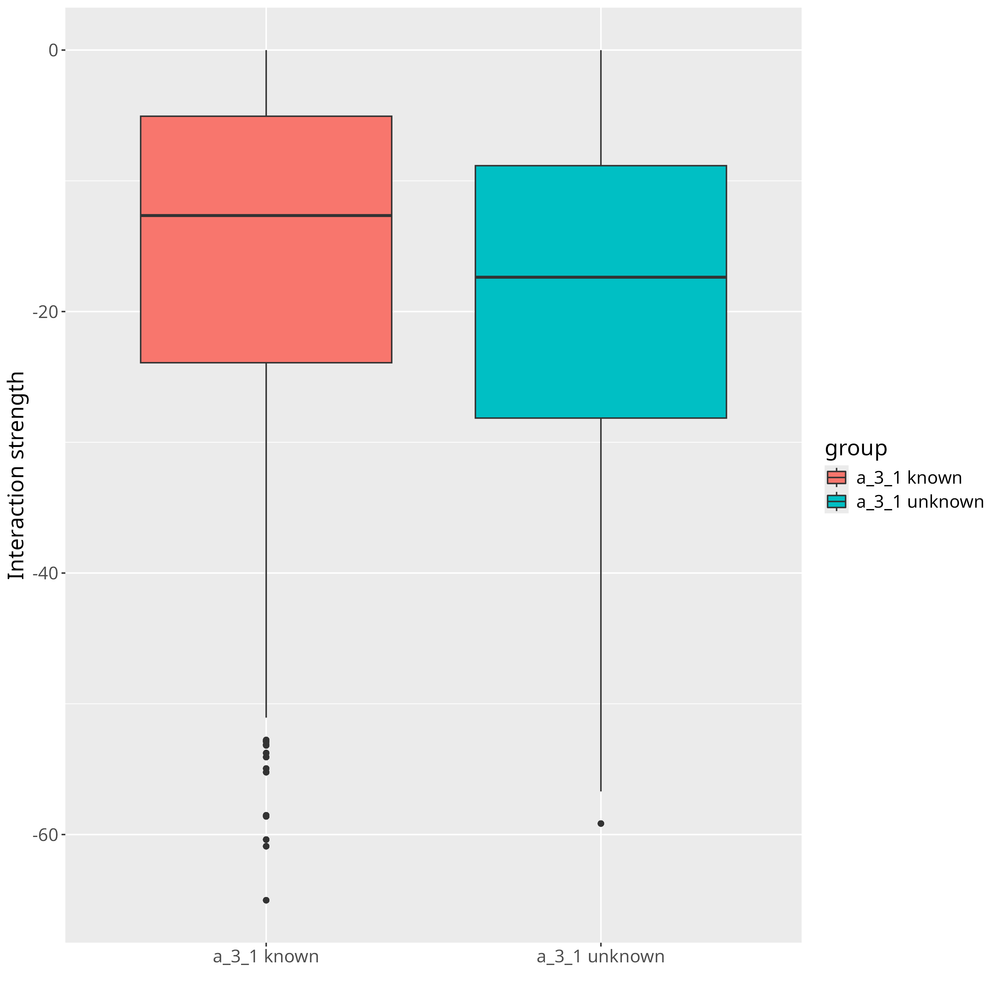
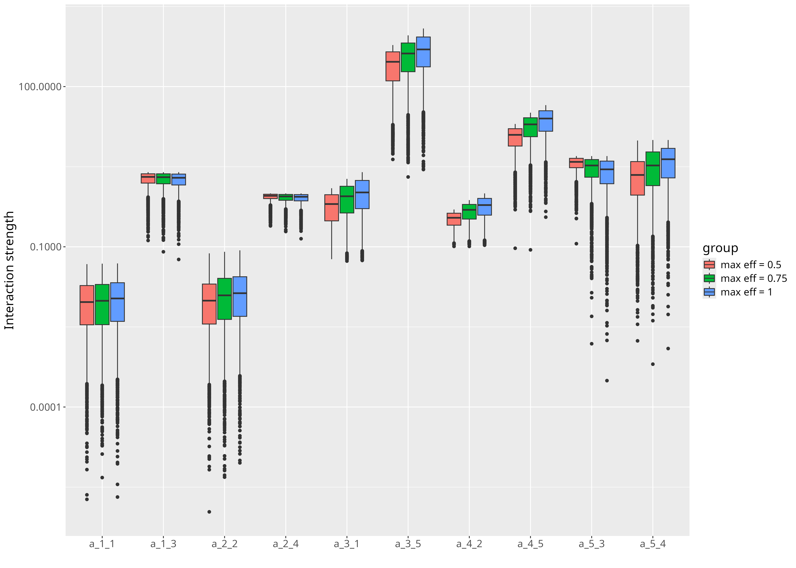
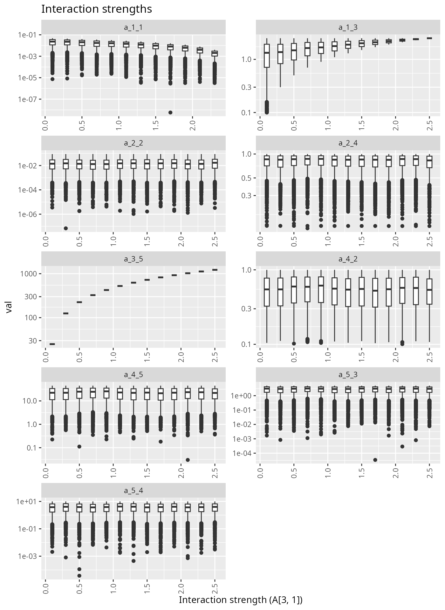
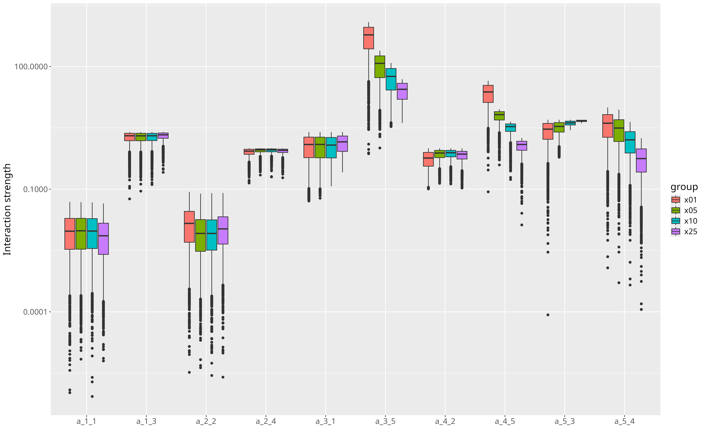

---
# A five species example - resilience 


---
# Setting a<sub>5,3</sub> to a constant


???
decreasing unknown 

---
# Setting a<sub>5,3</sub> to a constant





---
# Refining energy constraints




---
# Refining energy constraints


---
# Increasing a<sub>3,1</sub>


---
# Increasing a<sub>3,1</sub>




---
# Linear Inverse Models in Food Webs

## A note about Ecopath

- **Ecopath**: mass balance modelling
- 2 master equations 

```
Production = catch + predation + net migration + 
  biomass accumulation + other mortality

Consumption = production + respiration + unassimilated food
```

- `r lk()` https://ecopath.org/about/#toggle-id-1


---
# Management Challenges With LIM

### Adding constraints will reduce the interaction strength space 

### Refining know

- Refining 
  - refined constraints on trophic efficiency
  - evaluating biomass variability


---
# Increasing top predator biomass




???
we get the full portray
till here we had the biomass fix


---
# Increasing top predator biomass


