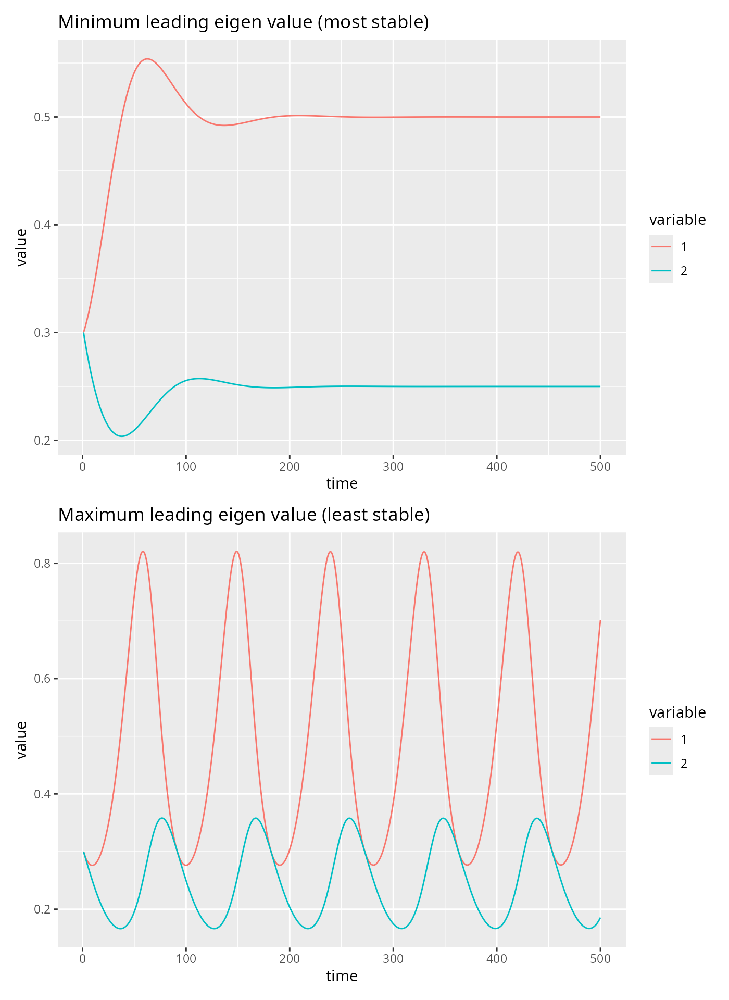

class: title-slide, middle


# Estimation of Food Webs Interactions with Linear Inverse Models

.instructors[
  .font180[**Kevin Cazelles, Kevin McCann & Kayla Hale**]
  <br><br>
  .font120[2024-04-24]
]


<div class="logo">
</img>
</img>
</div>

```{r setup, include = FALSE}
library(iseWorkshops)
```

---
class: inverse, center, middle

# Introduction


---
# Linear Inverse Models

### Solve a system with a set of equalities and inequalities

</br>

.pull-left[

$$\mathbf{E} \mathbf{x} = \mathbf{f}$$

$$\mathbf{E} \mathbf{x} \approx \mathbf{b}$$

$$\mathbf{E} \mathbf{x} \geq \mathbf{g}$$

]


---
# Linear Inverse Models


### Solve a system with a set of equalities and inequalities

</br>


.pull-left[

$$\mathbf{E} \color{black}{\mathbf{x}} = \mathbf{f}$$

$$\mathbf{E} \color{black}{\mathbf{x}} \approx \mathbf{b}$$

$$\mathbf{E} \color{black}{\mathbf{x}} \geq \mathbf{g}$$

]


.pull-right[

$$2\color{black}{x} = 12$$

</br>

$$2\color{black}{x} + \color{black}{y} > 12$$


]


---
# Linear Inverse Models


### Solve a system with a set of equalities and inequalities

</br>

.pull-left[

$$\mathbf{E} \color{black}{\mathbf{x}} = \mathbf{f}$$

$$\mathbf{E} \color{black}{\mathbf{x}} \approx \mathbf{b}$$

$$\mathbf{E} \color{black}{\mathbf{x}} \geq \mathbf{g}$$

]


.pull-right[

$$2\color{black}{x} = 12$$

</br>

$$2\color{black}{x} + \color{black}{y} > 12$$

$$\color{black}{x} > 0;  \color{black}{y} > 0$$
$$\color{black}{y} < 4 $$
]


--
### Large array of problems 

- Optimal transportation, clustering, solving Sudoku, etc.
- `r lk()` https://jump.dev/JuMP.jl/stable/tutorials/linear/diet/


---
# Linear Inverse Models in Food Webs


- `r bk()` Soetaert & Van Oevelen (2009), **Oceanography**. 


???
You may know some flows


---
# Linear Inverse Models in Food Webs


- Biomasses known
- Linear relationships among flux
- `r bk()` Soetaert & Van Oevelen (2009), **Oceanography**. 


---
# Linear Inverse Models in Food Webs


- `r bk()` Soetaert & Van Oevelen (2009), **Oceanography**. 


---
# Linear Inverse Models in Food Webs


- `r bk()` Soetaert & Van Oevelen (2009), **Oceanography**. 


---
# Linear Inverse Models in Food Webs

## A note about Ecopath

- **Ecopath**: mass balance modelling
- 2 master equations 

```
Production = catch + predation + net migration + 
  biomass accumulation + other mortality

Consumption = production + respiration + unassimilated food
```

- `r lk()` https://ecopath.org/about/#toggle-id-1


---
# Linear Inverse Models in Food Webs

## Let's keep in mind 

1. LIM approach can be used to combine a set of constraints on a mass balance model to estimate the masse/energy flows;

2. the more the constraints, the smaller the solution space.


---

class: inverse, center, middle

# LIM and food web stability


---
# LIM in classical Lotka-Volterra

</br>

$$\begin{equation}\begin{aligned}
\frac{dPrey}{dt}      &= Prey \left( r_{Prey} + a_{1, 1} Prey - a_{1, 2} Predator \right) \\
\frac{dPredator}{dt}  &= Predator \left( r_{Predator} + a_{2, 1} Prey \right)
\end{aligned}\end{equation}$$


---
# LIM in classical Lotka-Volterra

</br>

$$\begin{equation}\begin{aligned}
\frac{d\color{black}{Prey}}{dt}      &= \color{black}{Prey} \left( r_{Prey} + a_{1, 1} \color{black}{Prey} - a_{1, 2} \color{black}{Predator} \right) \\
\frac{d\color{black}{Predator}}{dt}  &= \color{black}{Predator} \left( r_{Predator} + a_{2, 1} \color{black}{Prey} \right)
\end{aligned}\end{equation}$$

Classically: 

1. variation of $Predator$ and $Prey$ population (individuals, biomass)
2. study of the stability of the system 


---
# LIM in classical Lotka-Volterra

### Assumptions 

- near equilibrium 
- biomass known

$$\begin{equation}\begin{aligned}
\left( r_{Prey} + a_{1, 1} Prey - a_{1, 2} Predator \right) &= 0\\
\left( r_{Predator} + a_{2, 1} Prey \right) &= 0
\end{aligned}\end{equation}$$


---
# LIM in classical Lotka-Volterra

### Assumptions 

- near equilibrium 
- biomass known

$$\begin{equation}\begin{aligned}
0 &= \left( r_{Prey} + \color{black}{a_{1, 1}} Prey - \color{black}{a_{1, 2}} Predator \right) \\
0 &= \left( r_{Predator} + \color{black}{a_{2, 1}} Prey \right)
\end{aligned}\end{equation}$$


---
# LIM in classical Lotka-Volterra

### Example 

1. Prey and Predator biomass known 
2. Interaction are positive + Prey `r ar()` Predator **<** Prey `r ar()` Predator


---
# LIM in classical Lotka-Volterra



???
if stability taken as resilience so..


---
# Using more constraints


- `r bk()` Gellner, McCann & Hasting (2023), **PNAS**. 


---
# Using more constraints


- `r bk()` Gellner, McCann & Hasting (2023), **PNAS**. 


---

class: inverse, center, middle

# Solving management challenges with LIM 


---
# A five species example

.pull-left[
</br>

- 5 species 
- 10 interactions
- **constraints**: interactions are positive and asymmetrical
]

.pull-right[
.font50[
|Symbol        | Name                        |
|:------------ |:--------------------------- |
|$$a_{1, 1}$$   | intraspecific competition  |
|$$a_{1, 3}$$  | prey -> predator           |
|$$a_{2, 2}$$   | intraspecific competition  |
|$$a_{2, 4}$$   | prey -> predator           |
|$$a_{3, 1}$$   | predator <- prey           |
|$$a_{3, 5}$$   | predator -> top predator           |
|$$a_{4, 2}$$   | predator <- prey           |
|$$a_{4, 5}$$   | predator -> top predator   |
|$$a_{5, 3}$$   | top predator <- predator   |
|$$a_{5, 4}$$   | top predator <- predator   |
]

]

---
# A five species example - resilience 


---
# A five species example - resilience 


- 25% most stable (resilient)

---
# Setting a<sub>5,3</sub> to a constant

.pull-left[

]

.pull-right[

]

???
decreasing unknown 

---
# Increasing a<sub>3,1</sub>


---
# Increasing a<sub>3,1</sub>


---
# Adding more constraints


---
# Increasing top predator biomass


???
we get the full portray


---
# Analyzing temporal variation 


---
# Future Challenges 


## A flexible tools to add constraints 

- allometric constraints (previous presentation)

- constraints based on time series (variation of biomass)

--

## Work on real food webs 

- This requires **data** (next presentation)
  - food webs topology  (spatially explicit)
  - biomass time series
  - interactions constrains 
 


---
class: inverse, center, middle

# Interactive tool (Shiny App)


<!-- demo here 5-10 min -->
