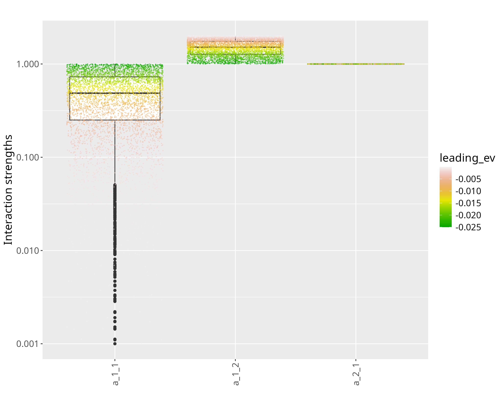
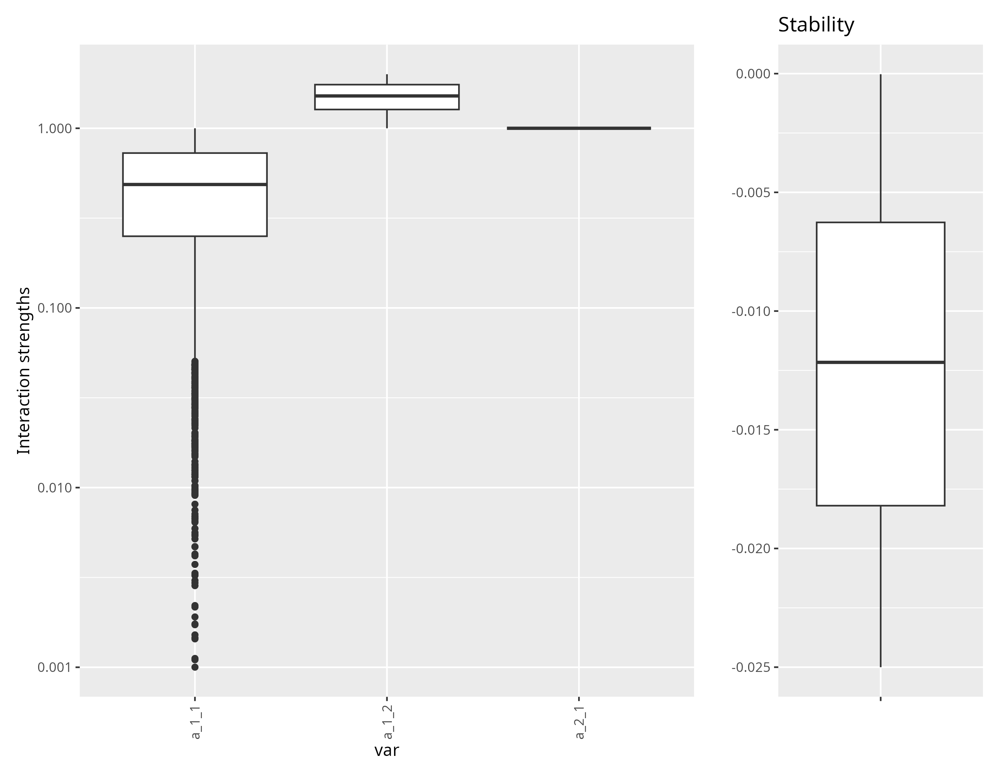
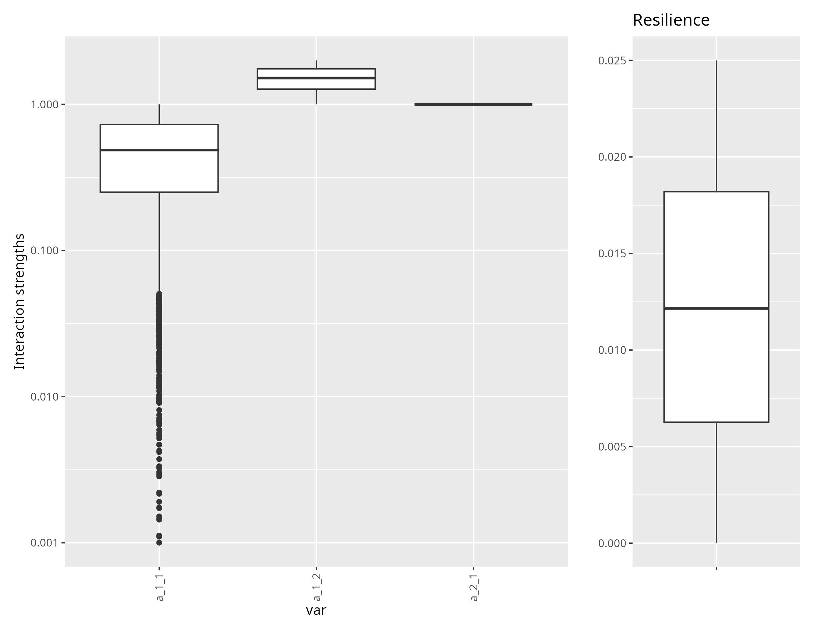

class: title-slide, middle


# Estimation of Food Webs Interactions with Linear Inverse Models

.instructors[
  .font180[**Kevin Cazelles, Kevin McCann & Kayla Hale**]
  <br><br>
  .font120[2024-04-24]
]


<div class="logo">
</img>
</img>
</div>

```{r setup, include = FALSE}
library(iseWorkshops)
```

---
class: inverse, center, middle

# Introduction


---
# Linear Inverse Models

### Solve systems of equalities, inequalities and approximations


.pull-left[

$$\mathbf{E} \mathbf{x} = \mathbf{f}$$

$$\mathbf{E} \mathbf{x} \approx \mathbf{b}$$

$$\mathbf{E} \mathbf{x} \geq \mathbf{g}$$

]

---
# Linear Inverse Models


### Solve systems of equalities, inequalities and approximations


.pull-left[

$$\mathbf{E} \color{red}{\mathbf{x}} = \mathbf{f}$$

$$\mathbf{E} \color{red}{\mathbf{x}} \approx \mathbf{b}$$

$$\mathbf{E} \color{red}{\mathbf{x}} \geq \mathbf{g}$$

]


---
# Linear Inverse Models


### Solve systems of equalities, inequalities and approximations


.pull-left[

$$\mathbf{E} \color{red}{\mathbf{x}} = \mathbf{f}$$

$$\mathbf{E} \color{red}{\mathbf{x}} \approx \mathbf{b}$$

$$\mathbf{E} \color{red}{\mathbf{x}} \geq \mathbf{g}$$

]


.pull-right[

$$2\color{red}{x} = 12$$

</br>

$$2\color{red}{x} + \color{red}{y} = 12$$

2 unknown variables, 1 equality

]


---
# Linear Inverse Models


### Solve systems of equalities, inequalities and approximations


.pull-left[

$$\mathbf{E} \color{red}{\mathbf{x}} = \mathbf{f}$$

$$\mathbf{E} \color{red}{\mathbf{x}} \approx \mathbf{b}$$

$$\mathbf{E} \color{red}{\mathbf{x}} \geq \mathbf{g}$$

]


.pull-right[

$$2\color{red}{x} = 12$$

</br>

$$\color{red}{y} = 12 - 2\color{red}{x}$$

in other words, a **line** 

]


---
# Linear Inverse Models

### Solve systems of equalities, inequalities and approximations

.pull-left[

$$\mathbf{E} \color{red}{\mathbf{x}} = \mathbf{f}$$

$$\mathbf{E} \color{red}{\mathbf{x}} \approx \mathbf{b}$$

$$\mathbf{E} \color{red}{\mathbf{x}} \geq \mathbf{g}$$

]


.pull-right[

$$2\color{red}{x} = 12$$

</br>

$$2\color{red}{x} + \color{red}{y} = 12$$

$$\color{red}{x} > 0;  \color{red}{y} > 0$$
$$\color{red}{y} < 4 $$
]

all $(\color{red}{x}, \color{red}{y})$ such as $\color{red}{y} = 12 - 2\color{red}{x}$ and $x \in ]4, 6[$ : a **segment**

--
### Large array of problems 

- Optimal transportation, clustering, solving Sudoku, etc.
- `r lk()` https://jump.dev/JuMP.jl/stable/tutorials/linear/diet/


---
# Linear Inverse Models in Food Webs


- `r bk()` Soetaert & Van Oevelen (2009), **Oceanography**. 


???
You may know some flows


---
# Linear Inverse Models in Food Webs


.pull-left[
  </br>
  $$\frac{dB_i}{dt} = f_1 + f_2 + f_3 + ... $$

]

.pull-right[
  
  
]

--

- Mass balance 

--

- A set of equalities 

--

- Some knowledge about flows:
  - known parameters: $f_1 = 2.5$
  - inequalities: $f_1 > f_2$
  - approximations: $f_1 \approx 2.5$

--


---
# Linear Inverse Models in Food Webs

$$\frac{dB_i}{dt} = f_1 + f_2 + f_3 + ... $$

- Using LIM, we obtained a **space**, sets of working flows $(f_1, f_2, ...)$


---
# Linear Inverse Models in Food Webs


- `r bk()` Soetaert & Van Oevelen (2009), **Oceanography**. 


---
# Linear Inverse Models in Food Webs

## A note about Ecopath

- **Ecopath**: mass balance modelling
- 2 master equations 

```
Production = catch + predation + net migration + 
  biomass accumulation + other mortality

Consumption = production + respiration + unassimilated food
```

- `r lk()` https://ecopath.org/about/#toggle-id-1


---

class: inverse, center, middle

# LIM for food web resilience


---
# LIM in classical Lotka-Volterra

</br>

$$\begin{equation}\begin{aligned}
\frac{dPrey}{dt}      &= Prey \left( r_{Prey} + a_{1, 1} Prey - a_{1, 2} Predator \right) \\
\frac{dPredator}{dt}  &= Predator \left( r_{Predator} + a_{2, 1} Prey \right)
\end{aligned}\end{equation}$$

- Functional response type I


---
# LIM in classical Lotka-Volterra

</br>

$$\begin{equation}\begin{aligned}
\frac{d\color{red}{Prey}}{dt}      &= \color{red}{Prey} \left( r_{Prey} + a_{1, 1} \color{red}{Prey} - a_{1, 2} \color{red}{Predator} \right) \\
\frac{d\color{red}{Predator}}{dt}  &= \color{red}{Predator} \left( r_{Predator} + a_{2, 1} \color{red}{Prey} \right)
\end{aligned}\end{equation}$$

Classically: 

1. interactions are known 
2. we look variations of $Predator$ and $Prey$ population (individuals, biomass)
3. study of the stability of the system 


---
# LIM in classical Lotka-Volterra

### Assumptions 

- biomass known
- near equilibrium we have:


$$\begin{equation}\begin{aligned}
\left( r_{Prey} + a_{1, 1} \color{red}{Prey} - a_{1, 2} \color{red}{Predator} \right) &= 0\\
\left( r_{Predator} + a_{2, 1} \color{red}{Prey} \right) &= 0
\end{aligned}\end{equation}$$


---
# LIM in classical Lotka-Volterra

### Assumptions 

- biomass known
- near equilibrium we have:

$$\begin{equation}\begin{aligned}
\left( r_{Prey} + \color{red}{a_{1, 1}} Prey - \color{red}{a_{1, 2}} Predator \right) &= 0\\ 
\left( r_{Predator} + \color{red}{a_{2, 1}} Prey \right) &= 0
\end{aligned}\end{equation}$$

--

### Let's use LIM

- 2 equalities 
- 3 unknown variables: **interaction strengths** that are hard to measure
-  $Prey$ and $Predator$ are known: **biomass/population known**
- **Interactions are positive**
- **Interactions are asymmetrical**:
  - conversion efficiency: $a_{1, 2} > a_{2,1}$


---
# Sets of interactions strengths

Sets of interactions strengths that lead to the observed biomass

|  $a_{1,1}$| $a_{2,1}$ | $a_{1,2}$ |
|---------:|-----:|--------:|
| 0.1326175|     1| 1.867382|
| 0.2158816|     1| 1.784118|
| 0.0697550|     1| 1.930245|
| 0.3031896|     1| 1.696810|
| 0.0743744|     1| 1.925626|
| 0.2347560|     1| 1.765244|
| 0.4509523|     1| 1.549048|
| 0.3427189|     1| 1.657281|
| 0.3577168|     1| 1.642283|


---
# Distribution of interactions strengths


---
# Resilience metric

$$\begin{equation}\begin{aligned}
\frac{dPrey}{dt}      &= Prey \left( r_{Prey} + a_{1, 1} Prey - a_{1, 2} Predator \right) \\
\frac{dPredator}{dt}  &= Predator \left( r_{Predator} + a_{2, 1} Prey \right)
\end{aligned}\end{equation}$$

- We use the Jacobian to determine the **leading eigen value** a proxy for **reslience**


---
# Distribution of interactions strengths




---
# Distribution of interactions strengths




---
# Distribution of interactions strengths




---
# Most stable system


???
if stability taken as resilience so...

---
# Least stable system


---
# LIM in classical Lotka-Volterra


- Distribution of **interactions** = portray of the **biostructure**  

--

- Distribution of **resilience** of potential biostructures 

--

- The more constraints, the smaller the space

--

- Dynamics can be used to select among potential biostructures! 


---
# Using more constraints

### No Constraints 


- Diversity increases `r ar()` stability decreases 


- `r bk()` Gellner, McCann & Hasting (2023), **PNAS**. 


---
# Using more constraints

### Realistic constraints


- Diversity increases `r ar()` stability decreases 


???
it is a very hopeful results if you use constraints interaction inference 
may be doable


---

class: inverse, center, middle

# Towards Solving Management Challenges With LIM 


???
go over various potential avenues where we can use LIM


---
# A five species example

.pull-left[


- 5 species, 10 interactions
- **assumptions**:
  - Lotka-Volterra
  - biomass/population known 
]

.pull-right[
.font50[
|Symbol        | Name                        |
|:------------ |:--------------------------- |
|$$a_{1, 1}$$   | intraspecific competition  |
|$$a_{1, 3}$$   | prey -> predator           |
|$$a_{2, 2}$$   | intraspecific competition  |
|$$a_{2, 4}$$   | prey -> predator           |
|$$a_{3, 1}$$   | predator <- prey           |
|$$a_{3, 5}$$   | predator -> top predator   |
|$$a_{4, 2}$$   | predator <- prey           |
|$$a_{4, 5}$$   | predator -> top predator   |
|$$a_{5, 3}$$   | top predator <- predator   |
|$$a_{5, 4}$$   | top predator <- predator   |
]

]

---
# A five species example

.pull-left[


- 5 species, 10 interactions
- **assumptions**:
  - Lotka-Volterra
  - biomass/population known 
]

.pull-right[

### constraints

interaction strengths are:

- positive
- asymmetrical $a_{1,3} > a_{3,1}$

]

---
# A five species example - resilience 


- Potential biostructures and their resilience


---
# Lest stable vs. top 25% most stable


---
# Lest stable vs. top 10% most stable


---
# Lest stable vs. top 1% most stable


---
# Analyzing temporal variation 


---
# Analyzing temporal variation 


---
# Analyzing temporal variation 


---
# Future Challenges 


## A flexible tools to add constraints 

- allometric constraints (previous presentation)
- constraints based on time series (variation of biomass)

--

## Work on real food webs 

- This requires **data** (next presentation)
  - food webs topology  (spatially explicit)
  - biomass time series
  - interactions constraints 
 

---
# Expected outcomes 


1. Paper: "Towards Solving Management Challenges With LIM"

2. R package: "fwebinfr"

3. Shiny App 


---
class: inverse, center, middle

# Interactive tool (Shiny App)


<!-- demo here 5-10 min -->
